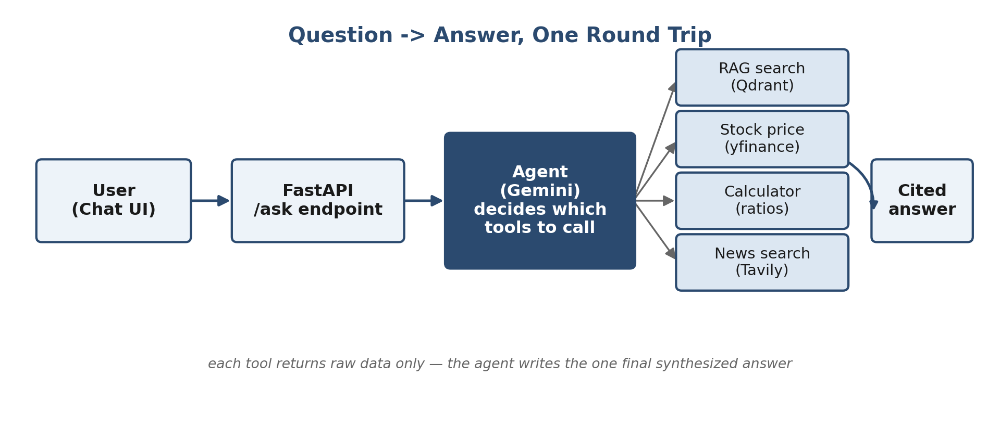
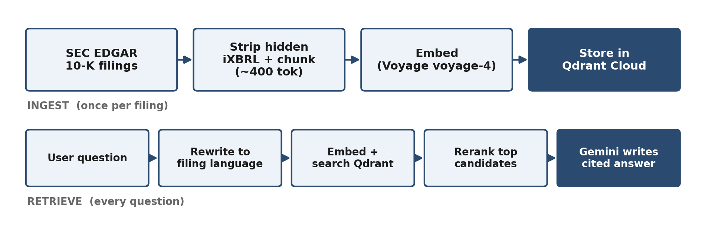
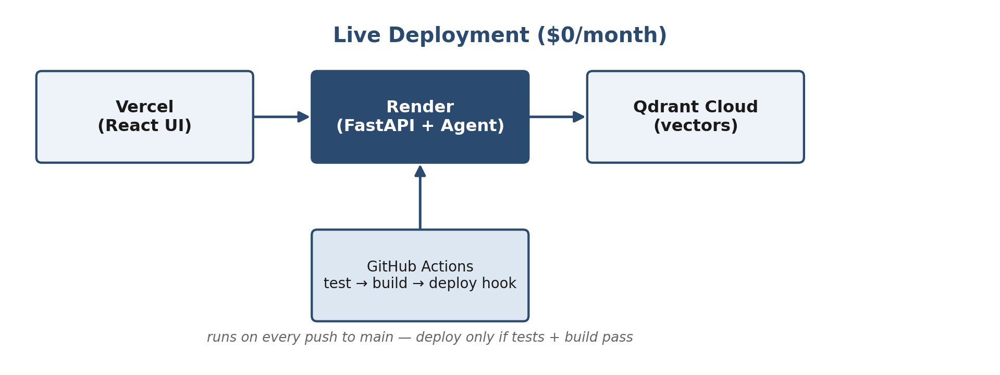

# Finance AI Assistant

An AI agent that answers finance questions about **Apple, Microsoft, and Nvidia** using real, live data instead of model memory — their actual SEC 10-K filings (retrieval-augmented generation), live stock prices, and current news. Ask a question in plain language; the agent decides which tools it needs and returns one cited answer.

**Live demo:** [finance-ai-ui-vercel.vercel.app](https://finance-ai-ui-vercel.vercel.app/)

[](https://github.com/srisaktic/finance-ai-assistant/actions/workflows/ci.yml)



---

## What it does

- Answers qualitative questions from real 10-K filings (risks, strategy, business description) via RAG, with citations
- Looks up live stock prices and key stats
- Computes financial ratios and percentage changes (margins, growth, etc.)
- Searches current news for a company or topic
- Synthesizes all of the above into one grounded answer — never guesses when a tool has no data

## Tech stack

| Layer | Technology |
|---|---|
| Data source | SEC EDGAR — real 10-K filings (AAPL, MSFT, NVDA) |
| Embeddings + rerank | Voyage AI (`voyage-4`, `rerank-2.5`) |
| Vector database | Qdrant Cloud |
| LLM / agent | Google Gemini (`gemini-3.1-flash-lite`), tool-calling loop |
| Market data | yfinance |
| News search | Tavily |
| Backend | FastAPI (Python) |
| Frontend | React + TanStack Start (TypeScript) |
| Packaging | Docker + Docker Compose |
| Testing | pytest |
| CI/CD | GitHub Actions — test → build → deploy |
| Hosting | Render (API) + Vercel (UI) + Qdrant Cloud (vectors) |

## How it works



A question hits `POST /ask` on the FastAPI backend, which passes it straight to the agent loop. Gemini reads the question against four available tools — `search_filings`, `get_stock_price`, the calculator, and `search_news` — decides which ones actually apply, and the orchestrator executes them. Every tool returns raw data only; synthesis into one coherent, cited answer happens exactly once, after all tool calls return.

The RAG path specifically: filings are chunked (~400 tokens, structure-aware) and embedded once at ingest time. Every question is rewritten into filing-style language, embedded, searched in Qdrant, reranked against the actual question, and only then handed to Gemini to write the final answer.

## Deployment



Every push to `main` runs the test suite and builds the Docker image in GitHub Actions; a deploy to Render is only triggered — via a private deploy hook — if both succeed. The frontend deploys separately on Vercel. Qdrant Cloud is kept from sleeping via a scheduled GitHub Action that pings it every few days.

## Project structure


## Running it locally

**Requirements:** Python 3.12, Node.js, and a free API key each from Voyage AI, Google AI Studio (Gemini), Tavily, and Qdrant Cloud.

1. Clone the repo and create a `.env` file in the project root with the following keys (get each from its respective provider — do not commit this file):
```
VOYAGE_API_KEY=
GEMINI_API_KEY=
TAVILY_API_KEY=
QDRANT_URL=
QDRANT_API_KEY=
```

2. Install backend dependencies and ingest the filings:

```bash
   python -m venv venv && source venv/bin/activate
   pip install -r requirements.txt
   python scripts/run_ingest.py
```

3. Run the API:

```bash
   uvicorn src.api.main:app --reload
   # -> http://localhost:8000/docs for interactive API docs
```

4. Run the frontend:

```bash
   cd ui
   npm install
   npm run dev
```

**Or run the backend with Docker:**

```bash
docker compose up --build
```

## Testing

```bash
python -m pytest
```

Covers the pure, dependency-free functions (calculator, ticker detection) — no paid or rate-limited API calls run in CI.

## Cost

Runs entirely on free tiers: Gemini, Voyage AI, Qdrant Cloud, Tavily, Render, and Vercel. Realistic total: **$0/month**.

## Known limitations

- Retrieval can still miss content nested in an unlabeled sub-section of a 10-K item (documented, not silently broken)
- Render's free tier cold-starts after 15 minutes of inactivity — first request after idle time is slow
- Test coverage is scoped to pure functions, not the full RAG/agent pipeline

## Documentation

Full build narrative and a decision-by-decision log (alternatives considered, real bugs hit, and why each call was made) are included in this repo as `Project_Documentation.pdf` and `Detailed_documentation.pdf`.

## Author

Sri Sakticharan
